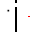
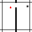

# HJEPA for TwoRooms: 階層型世界モデルによる長期計画の検証

本リポジトリは、**階層型Joint Embedding Predictive Architecture (H-JEPA)** を用いた世界モデルの構築と、長期計画（Planning）タスクにおける有効性を検証するプロジェクトです。
途中経過として、TwoRooms（壁のある2部屋環境）を用いた実験により世界モデルの階層化が推論効率と予測精度の向上に寄与することを実証します。

## プロジェクト概要 (Overview)

本研究は、Sobalらによって提案された **「PLDM (Planning with Latent Dynamics Models)」** を基礎としています。
PLDMは、Yann LeCunらが提唱する **JEPA (Joint Embedding Predictive Architecture)** を用いて潜在ダイナミクスモデルを学習し、それを用いたプランニングを行う手法です。従来のモデルフリー強化学習と比較して、報酬のないオフラインデータ（Reward-Free Offline Data）からの学習において、未知のレイアウトへの汎化性能やデータ効率に優れ、質の低いデータに対してもロバストであるという特性があります。

しかし、既存のPLDMにおいても、実用的な推論速度を確保するために行動系列の生成間隔（Temporal Abstraction）を広げると、予測精度の低下に伴いタスク成功率が低下するという課題がありました。
本研究では、この課題に対処するため、JEPAの表現学習を**階層的構造 (Hierarchical Structure)** へと拡張します。世界モデル自体を階層化することで、推論効率と予測精度の両立を図り、特に長期的な計画が必要とされるタスクにおける有効性を検証します。

具体的には、従来の単一階層構造を明示的な二階層構造（L1: Base Level, L2: Abstract Level）へと刷新し、Tworooms環境等において、モデルパラメータ数や予測ホライズンの変化が性能に及ぼす影響を体系的に評価します。

## リサーチギャップと課題 (Research Gap)

### 1. 推論効率と精度のトレードオフ
PLDMのようなモデルベースアプローチにおいて、計算コストを削減し実用的な速度を得るために計画の間隔（Step Skip等）を広げる手法が一般的ですが、これは予測精度の低下とトレードオフの関係にあります。既存研究ではこのトレードオフにより、長期計画におけるタスク成功率が著しく悪化する場合がありました。本研究では、階層化によってこの問題を解決し、推論効率と高精度な計画の両立を目指します。

### 2. 階層的表現学習の実装レベルでの検証不足
潜在ダイナミクスモデルとして採用されているJEPAにおいては、構想レベルで階層的表現学習の有効性が示唆されていますが、実際に **「階層化そのもの」がプランニング性能の向上にどの程度寄与しているか**については、実装レベルでの検証が十分ではありませんでした。

本研究では、計算資源・推論時間が十分な場合と制約された場合でのHJEPAの有効性を比較し、階層化が有効に機能する条件とそうでない条件を明らかにすることで、PLDMにおける階層表現の適用可能性と限界についての理解を深めます。

---

## 主な実験結果 (Experimental Results)

TwoRooms環境 (`wall_medium`) において、20エピソードの固定スタート・ゴールを用いた比較評価を行いました。
L2モデル（階層化モデル）は、同程度のパラメータ数を持つ大規模L1モデルと比較しても、優れたパフォーマンスを示しています。

| 指標 (Metric) | 説明 | L1 (単体) | L1 + L2 (階層型) | 改善率 |
| :--- | :--- | :---: | :---: | :---: |
| **Cross Wall Rate** | 壁の向こう側へ到達できた割合 (Higher is better) | 32.0% | **42.0%** | +10.0pt |
| **Init Plan Cross Rate** | 初期計画が壁を越えていた割合 (Higher is better) | 53.0% | **57.0%** | +4.0pt |
| **Planning Error (Mean)** | ゴール到達時の平均誤差 (Lower is better) | 527.75 | **405.45** | -122.3 |
| **Planning Error (RMSE)** | ゴール到達時の誤差の二乗平均平方根 (Lower is better) | 22.97 | **20.14** | -2.83 |

**考察:**
L2モデル導入により、壁越えの成功率が向上するだけでなく、計画誤差（Planning Error Mean/RMSE）が低減しており、より正確な長期計画が可能になっていることがわかります。

## 動作デモ (Demo)

<div style="display: flex; justify-content: space-around;">
  <div style="text-align: center;">
    <h4>L1 Model (Base)</h4>
    <p>計画が壁の手前で停滞しやすい</p>
    
  </div>
  <div style="text-align: center;">
    <h4>L2 Model (Hierarchical)</h4>
    <p>壁を越える計画を生成し、ゴールへ到達</p>
    
  </div>
</div>

---

## 今後の展望 (Future Work)

本研究のさらなる発展として、以下の検証・拡張を予定しています。

1.  **階層設計の最適化**: 階層化のアプローチとして、サブゴール方式を採用するか、あるいはL1層への直接的な介入（挿入）を行うか、アーキテクチャの比較検討。
2.  **離散化の導入**: 潜在空間の離散化による、よりロバストな抽象表現の獲得と計画精度の向上。
3.  **複雑なタスクでの検証**: TwoRoomsよりも複雑な迷路や、動的な障害物が存在する環境での追加実験。
4.  **プランニング崩壊点の定量化**: 現在採用しているMPPI（Model Predictive Path Integral）によるプランニングが、何ステップ先の予測で精度が崩壊し始めるかを定量的に測定する実験の実施。

---

## 実験の再現方法 (Usage)

### ディレクトリ構成
```text
.
├── PLDM_hieral/              # 実験用スクリプトおよび設定ファイル群
│   ├── configs/              # モデル設定 (YAML)
│   ├── run_tworooms_compare.py   # 比較実験実行スクリプト
│   └── generate_wall_trials.py    # 評価用エピソード生成スクリプト
├── pldm/                     # 世界モデル (JEPA) コア実装
└── pldm_envs/                # 環境定義
```

### 1. データセット準備
```bash
bash -c "cd pldm_envs/wall && bash presaved_datasets/download_all.sh"
bash -c "cd pldm_envs/wall && bash presaved_datasets/render_all.sh"
```

### 2. 実行コマンド (Local)

**L1とL2の比較検証**
```bash
python PLDM_hieral/run_tworooms_compare.py --mode both
```

**パラメータ数を揃えた比較 (L1 6M vs L2)**
```bash
# 評価データ生成
python PLDM_hieral/generate_wall_trials.py \
  --config PLDM_hieral/configs/tworooms_l1.yaml \
  --output_train PLDM_hieral/wall_trials_train.npz \
  --output_eval PLDM_hieral/wall_trials_eval.npz \
  --n_eval 20

# L1 (6M) 実行
python PLDM_hieral/run_tworooms_compare.py \
  --config_l1 PLDM_hieral/configs/tworooms_l1_6m.yaml \
  --mode l1
```

### 3. Google Colabでの実行
`PLDM_hieral/colab_pack.sh` でソースコードをtar化し、Google Colab上で `PLDM_hieral/colab_run.ipynb` を用いて実験を再現可能です。
