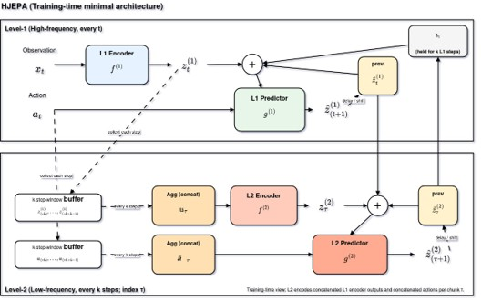
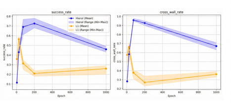
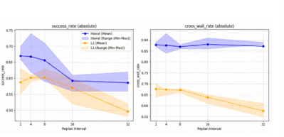
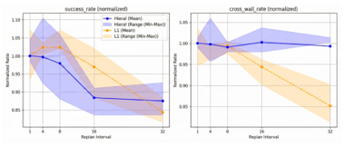
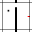
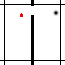

# JEPAベース世界モデルにおける階層化の提案

**A Proposal for Hierarchical Architecture in JEPA-based World Models**

---

## 概要 (Abstract)

オフラインデータに基づく世界モデルを用いたプランニング手法「PLDM」に着目し、内部のJEPAベース遷移モデルを**明示的な二階層構造 (H-JEPA)** へと拡張することで、表現の階層化が性能に与える影響を検証しました。

既存のPLDMでは、実用的な推論速度を確保するために行動系列の生成間隔を広げる必要がある一方、生成間隔を広げるほど予測の累積誤差が増大し、タスク成功率が著しく低下するという課題がありました。本研究では、世界モデルを階層化することによる**推論効率と予測精度の両立**を図ります。

TwoRooms環境において、限られた学習データ（5078サンプル）での階層化モデルの有効性と特性を調査し、JEPAベースの世界モデルにおいても階層化が長期予測の精度を改善する可能性が示唆されました。


## 階層化の手法 (Architecture & Loss)

### アーキテクチャ

H-JEPAは低位 (Level-1; L1) での高速な表現遷移と、高位 (Level-2; L2) での遅い時間スケールの表現遷移を組み合わせます。L1のpredictorはRNNベース（毎ステップの物理的連続性に基づく予測）、L2のpredictorもRNNベースで、k ステップ分の L1 表現を concat 集約した粗い時間軸での遷移を学習します。

```
                      ┌─────────────────────────────────────────────┐
  Level-1 (高頻度)     │  Observation x_t                            │
                      │       │                                     │
                      │  L1 Encoder f⁽¹⁾ ──→ z_t⁽¹⁾                │
                      │       │                    ↑                │
                      │  L1 Predictor g⁽¹⁾ ──→ ẑ_{t+1}⁽¹⁾ + b_t   │
                      │       ↑                    ↑                │
                      │    Action a_t         L2 フィードバック       │
                      └───────────────────────────┬─────────────────┘
                                                  │ Agg (concat, every k steps)
                      ┌───────────────────────────┴─────────────────┐
  Level-2 (低頻度)     │  L2 Encoder f⁽²⁾ ──→ z_τ⁽²⁾                │
                      │       │                                     │
                      │  L2 Predictor g⁽²⁾ ──→ ẑ_{τ+1}⁽²⁾          │
                      │       ↑                                     │
                      │    Agg actions ā_τ                          │
                      └─────────────────────────────────────────────┘
```

**L2 → L1 フィードバック**: L2の自己回帰状態 (l2_prev) を線形写像 $W_{2 \to 1}$ でL1空間に射影し、L1予測に加算することで補正を行います。

$$\tilde{z}_t^{(1)} = z_t^{(1)} + \hat{z}_t^{(1)} + b_t, \quad b_t = W_{2 \to 1} \, z_{\tau(t)}^{(2)}$$



### 損失関数

<script type="text/javascript" async src="https://cdnjs.cloudflare.com/ajax/libs/mathjax/3.2.2/es5/tex-mml-chtml.min.js"></script>

各レベルで以下の損失を導入し、その重みつき和を最終的な目的関数とします。

**1. 予測相似性損失** — 予測器が実際の潜在状態をどれだけ正確に予測できているかを測定

$$ L_{sim} = \sum_{k=1}^{K} \sum_{t=0}^{H} \frac{1}{N} \sum_{b=0}^{N} |\hat{Z}^k_{t,b} - Z_{t,b}|_2^2 $$

**2. 分散正則化損失** — 潜在表現が一点に収束（崩壊）するのを防ぐ

$$ L_{var} = \frac{1}{HD} \sum_{t=0}^{H} \sum_{j=0}^{D} \max(0, \gamma - \sqrt{\text{Var}(Z_{t,:,j}) + \epsilon}) $$

**3. 共分散正則化損失** — 各次元間の相関を抑え、特徴量の冗長性を排除

$$ L_{cov} = \frac{1}{H} \sum_{t=0}^{H} \frac{1}{D} \sum_{i \neq j} [C(Z_t)]^2_{i,j} $$

**4. 逆ダイナミクス損失** — 連続する潜在状態から行動を予測させ、行動関連情報を保持

$$ L_{IDM} = \sum_{t=0}^{H} \frac{1}{N} \sum_{b=0}^{N} |a_{t,b} - \text{MLP}(Z_{t,b}, Z_{t+1,b})|_2^2 $$

**5. 時間的滑らかさ損失** — 潜在表現の時間的連続性を維持

$$ L_{time\text{-}sim} = \sum_{t=0}^{H-1} \frac{1}{N} \sum_{b=0}^{N} |Z_{t,b} - Z_{t+1,b}|_2^2 $$

**最終損失関数** — 各階層 $\ell \in \{1, 2\}$ で上記損失の重みつき和を計算

$$ L_{HJEPA} = \sum_{\ell=1}^{L} \left( L_{sim}^{(\ell)} + \alpha_\ell L_{var}^{(\ell)} + \beta_\ell L_{cov}^{(\ell)} + \delta_\ell L_{time\text{-}sim}^{(\ell)} + \omega_\ell L_{IDM}^{(\ell)} \right) $$

ここで $L = 2$（本研究）、各上付き添字 $(\ell)$ は第 $\ell$ 層における損失を表します。

---

## 実験結果 (Experimental Results)

### 実験1: 学習曲線による性能比較

学習エポック数 {5, 25, 75, 200, 1000} の各時点で評価を行いました。

- **Hieral (階層化モデル)** は小規模データセットにおいて安定した学習と高いタスク達成性能を示しました
- **L1 (ベースライン)** は早期に学習崩壊が見られましたが、Hieralではそのような急激な性能劣化は確認されず、安定した推論精度を獲得していることが確認されました



### 実験2: 長期予測の精度評価 (Replan Interval)

推論時の再計画間隔 (Replan) を {1, 4, 8, 16, 32} ステップに変化させ、長期的な計画能力を検証しました。

| 指標 | 説明 | 結果 |
|:---|:---|:---|
| **Success Rate** | ゴール到達率 | 両手法とも再計画間隔の拡大に伴い低下 |
| **Cross Wall Rate** | 壁通過成功率（中間目標の達成度） | **Hieralは高い値を維持** |





**考察**: 最終的なゴール到達には微細な制御が必要であり、長期予測における位置ズレが直結するためSuccess Rateは両手法とも低下しました。しかし、「壁を通過する」という大局的な行動意図については、Hieralが長期にわたって正しく予測・保持できることが示されました。これは上位層 (L2) が抽象的な状態遷移を扱うことで長期的なコンテキストを保持し、下位層 (L1) の予測が大局的な整合性を失わないよう寄与した結果と解釈できます。

### 動作デモ (Demo)

<div style="display: flex; justify-content: space-around;">
  <div style="text-align: center;">
    <h4>L1 Model (Baseline)</h4>
    <p>計画が壁の手前で停滞しやすい</p>
    
  </div>
  <div style="text-align: center;">
    <h4>Hieral Model (階層型)</h4>
    <p>壁を越える計画を生成し、ゴールへ到達</p>
    
  </div>
</div>

---

## 今後の課題 (Future Work)

- **パラメータ数を統一した比較実験**: 性能向上が「階層構造そのものの効果」か「パラメータ数増加による表現力向上」かを厳密に分離する
- **より複雑なタスクでの検証**: TwoRoomsより複雑な階層性が求められるタスクにおいて、上位層による抽象化がどのように機能するかを解析する

---

## 実験の再現方法 (Usage)

### ディレクトリ構成

```text
.
├── PLDM_hieral/               # 実験用スクリプトおよび設定ファイル群
│   ├── configs/               # モデル設定 (YAML)
│   ├── run_tworooms_compare.py          # L1 vs Hieral 比較実験
│   ├── run_tworooms_compare_feedback.py # Feedback版 比較実験
│   └── generate_wall_trials.py          # 評価用エピソード生成
├── pldm/                      # 世界モデル (JEPA) コア実装
│   ├── models/                # HJEPA, Feedback等のモデル定義
│   ├── evaluation/            # 評価ロジック
│   └── planning/              # MPC プランニング
└── pldm_envs/                 # 環境定義 (TwoRooms等)
```

### 1. データセット準備

```bash
bash -c "cd pldm_envs/wall && bash presaved_datasets/download_all.sh"
bash -c "cd pldm_envs/wall && bash presaved_datasets/render_all.sh"
```

### 2. 実行コマンド

**L1 vs Hieral 比較検証**
```bash
python PLDM_hieral/run_tworooms_compare.py --mode both
```

**Feedback版 階層化モデルの比較検証**
```bash
python PLDM_hieral/run_tworooms_compare_feedback.py \
  --config_l1 PLDM_hieral/configs/tworooms_l1.yaml \
  --config_l2 PLDM_hieral/configs/tworooms_feedback.yaml \
  --l2_from_scratch \
  --mode both \
  --epochs 200 \
  --output_root ./PLDM_hieral/output_feedback_ep200
```

**オプション**
```bash
python PLDM_hieral/run_tworooms_compare.py \
  --mode both --epochs 100 --seed 123 --output_root PLDM_hieral/outputs
```


tarballをColabにアップロードし、`PLDM_hieral/colab_run_feedback.ipynb` 等のノートブックで実行できます。

### 出力

- 各モデルの出力: `PLDM_hieral/outputs/` 配下
- サマリー: `summary.json`, `summary_epoch=*.json`
- 比較CSV: `PLDM_hieral/tworooms_compare.csv`（デフォルト）

---

## 関連文献 (References)

- Ha, D. & Schmidhuber, J. (2018). [World Models](https://arxiv.org/abs/1803.10122).
- LeCun, Y. (2022). [A Path Towards Autonomous Machine Intelligence](https://openreview.net/forum?id=BZ5a1r-kVsf).
- Sobal, V. et al. (2024). [Planning with Latent Dynamics Models (PLDM)](https://arxiv.org/abs/2410.04529).
- Bardes, A. et al. (2022). VICReg: Variance-Invariance-Covariance Regularization for Self-Supervised Learning. In *ICLR*.
- Wang, G. et al. (2025). [Hierarchical Reasoning Model](https://arxiv.org/abs/2506.21734).
